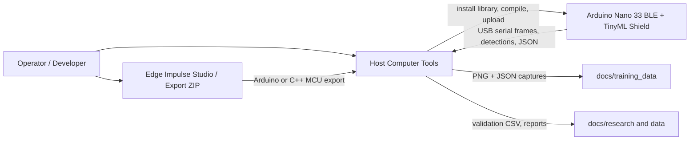
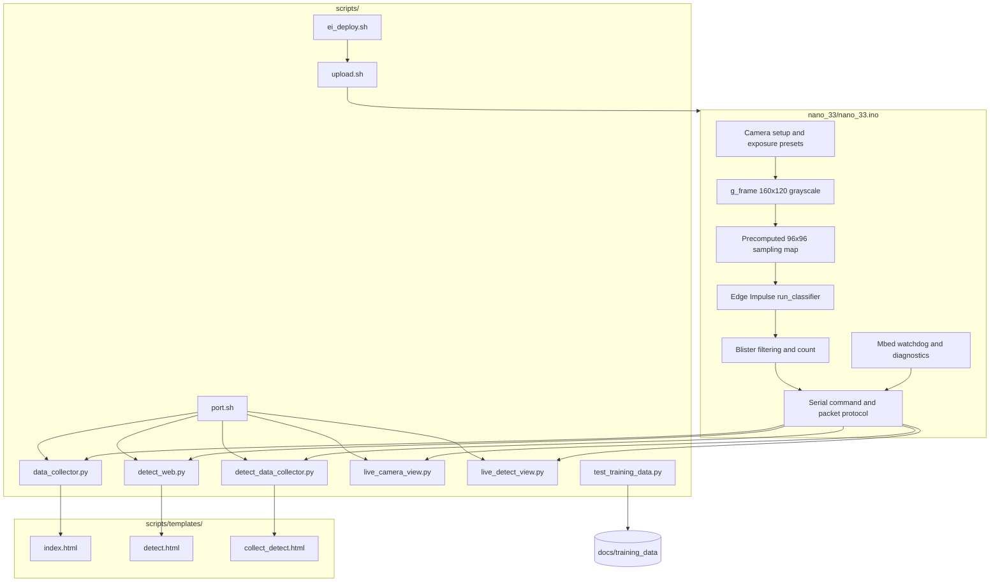
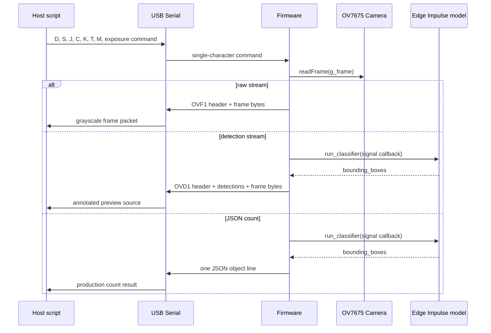

# Project Architecture Blueprint

Generated: 2026-05-28

This blueprint documents the actual architecture of the Nano 33 Medicine Counting repository. It is intended as the reference for preserving the current design while adding firmware features, host tools, model exports, and training-data workflows.

## 1. Architecture Detection and Analysis

### Detected Technology Stack

The repository is a hybrid embedded, Python tooling, and static browser UI project.

| Area | Technology | Evidence |
| --- | --- | --- |
| Firmware | Arduino C++ for Arduino Nano 33 BLE, Mbed Nano core | `nano_33/nano_33.ino`, `arduino:mbed_nano:nano33ble` in `scripts/upload.sh` |
| Camera | Arduino OV767X / TinyML Shield OV7675 | `#include <Arduino_OV767X.h>`, OV7675 SCCB register helpers in firmware |
| On-device ML | Edge Impulse FOMO object detection | `#include <pill_counting_inferencing.h>`, `run_classifier()`, bounding-box counting |
| Host tooling | Python scripts using PySerial, OpenCV, NumPy, Flask | `scripts/*.py`, browser viewers, image collectors |
| Shell orchestration | Bash wrappers around Arduino CLI, Python tools, and Edge Impulse deployment | `scripts/upload.sh`, `scripts/ei_deploy.sh`, `scripts/port.sh` |
| Browser UI | Flask-rendered static HTML templates with MJPEG streams and JSON endpoints | `scripts/templates/*.html` |
| Data and research | PNG/JPEG-like grayscale captures, JSON annotations, markdown research logs, CSV analysis | `docs/training_data/`, `docs/research/`, `data/` |

### Detected Architectural Pattern

The project is a **serial-protocol-centered embedded monolith with host-side adapters**.

The firmware is intentionally monolithic: capture, camera configuration, preprocessing, inference, counting, streaming, and protocol emission live in one Arduino sketch. The host-side Python scripts are independent adapters that connect to the board over USB serial and expose different operator workflows: OpenCV windows, Flask browser views, training-data capture, detection-assisted capture, and model validation.

The main architectural boundary is not a class hierarchy or service layer. It is the **serial protocol contract** between `nano_33/nano_33.ino` and `scripts/*.py`.

## 2. Architectural Overview

The system runs object detection on the microcontroller, not on the host. The Arduino captures 160x120 grayscale OV7675 frames, maps them to the Edge Impulse model's 96x96 input through a `signal_t` callback, runs FOMO inference, and exposes results through USB serial. Host tools consume either raw frames, detection frames, or JSON count responses.

Guiding principles visible in the implementation:

- Keep firmware memory predictable: one 160x120 grayscale frame buffer, static compile-time constants, no second full 96x96 image buffer.
- Make the serial protocol explicit and simple: single-character commands, magic-prefixed binary frame packets, one-line JSON for production counts.
- Keep model assumptions enforced close to deployment and compile time: Edge Impulse metadata validation in `scripts/ei_deploy.sh`, static assertions in the sketch, RAM gates in `scripts/upload.sh`.
- Let host tools be disposable adapters: Python scripts duplicate small packet parsing and rendering logic rather than forcing a shared package structure.
- Prefer local, inspectable workflows: Bash entrypoints detect ports, run compile/upload, start viewers, and launch collectors.

## 3. Architecture Visualization

### C4 Context



### Component View



### Runtime Data Flow



## 4. Core Architectural Components

### Firmware Sketch

**Purpose and responsibility**

`nano_33/nano_33.ino` owns all device behavior: hardware initialization, camera capture, exposure control, Edge Impulse inference, memory diagnostics, command processing, binary frame streaming, detection streaming, and production JSON counting.

**Internal structure**

- Constants define the hardware and model contract: 921600 baud, QQVGA, 160x120 grayscale, 96x96 model input via Edge Impulse macros, confidence threshold, and exposure presets.
- Global state is small and explicit: `g_frame`, sampling lookup tables, mode flags, frame number, and optional watchdog pointer.
- Helper groups are organized by concern rather than classes: SCCB register I/O, serial binary writers, exposure modes, inference mapping, detection filtering, JSON output, command handling, setup, and loop.

**Interaction patterns**

- Consumes Arduino libraries and the Edge Impulse generated library through headers.
- Exposes behavior through USB serial only.
- The `signal_t::get_data` callback samples from `g_frame` on demand, so inference can run without a second image buffer.

**Evolution patterns**

- Add new production operations as new serial commands only after checking command collisions.
- Add new output formats by defining a new magic packet or stable JSON shape.
- Keep model geometry tied to Edge Impulse metadata with `static_assert` and deploy-script validation.

### Serial Protocol

**Purpose and responsibility**

The serial protocol is the central system contract. It lets separate tools operate against the same firmware without sharing runtime code.

**Implemented commands**

| Command | Firmware behavior | Primary consumers |
| --- | --- | --- |
| `S` / `s` | Start raw frame stream | `data_collector.py`, `live_camera_view.py` |
| `P` / `p` | Stop raw/detection stream | Raw viewers, monitor |
| `D` / `d` | Start board-side detection stream | `detect_web.py`, `detect_data_collector.py`, `live_detect_view.py` |
| `X` / `x` | Stop counting/detection | Detection viewers |
| `J` / `j` | Single production JSON count | Production integrations and manual checks |
| `C` | Single verbose count | Serial monitor debugging |
| `K` / `k` | Continuous text count loop | Manual debugging |
| `T` / `t` | Capture/inference timing profile | Performance testing |
| `M` / `m` | Memory/model diagnostics | Deployment verification |
| `A` / `a`, `F` / `f`, `c` | Exposure modes | Viewers and collectors |
| `?` | Readiness/status help | Manual debugging |

**Binary packets**

- Raw stream packet: `OVF1` magic, width, height, bytes per pixel, format, frame number, frame size, then frame bytes.
- Detection stream packet: `OVD1` magic, raw-frame header fields, detection count, fixed-width detection records, then frame bytes.
- Both are little-endian after the magic prefix, as reflected by Python `struct.Struct("<HHBBII")` and `struct.Struct("<HHBBIIH")`.

### Host Python Tools

**Purpose and responsibility**

The Python scripts are workflow-specific adapters around the serial protocol. They decode packets, render previews, collect data, expose browser endpoints, and validate exported models against sample captures.

**Internal structure**

- `find_nano_port()` appears in multiple tools and uses PySerial port metadata plus `/dev/*usbmodem*` fallback.
- `scan_magic()` resynchronizes byte streams by scanning for `OVF1` or `OVD1`.
- Packet parsing uses `struct` and explicit frame-size validation.
- Browser tools use a background serial reader thread, shared state protected by locks, MJPEG streaming routes, `/stats` JSON, and `/control` POST endpoints.

**Interaction patterns**

- Python scripts hold the serial port exclusively while running.
- Flask tools provide local browser UIs; they do not change firmware behavior beyond queueing serial commands.
- Capture tools write durable artifacts into `docs/training_data/`.

**Evolution patterns**

- Add new viewers by reusing the current adapter pattern: serial connection, ready wait, command send, magic scan, packet parse, state update.
- Keep protocol constants local and obvious in each tool unless a shared Python package is introduced intentionally.
- Do not make host-side inference the default path; the architecture depends on board-side inference for production counts.

### Shell Entrypoints

**Purpose and responsibility**

Shell scripts provide stable project commands for compile/upload, monitoring, viewer startup, model deployment, and port detection.

**Key components**

- `scripts/upload.sh` compiles and optionally uploads firmware. It injects `EI_CLASSIFIER_ALLOCATION_STATIC`, parses dynamic memory use, warns above 210 KB, and fails above 220 KB.
- `scripts/ei_deploy.sh` accepts Edge Impulse Arduino Library or C++ MCU ZIP exports, normalizes the installed Arduino library to `pill_counting_inferencing`, patches export details for Nano 33 compatibility, and validates model metadata.
- `scripts/port.sh` provides the common hardware discovery path for all other shell wrappers.
- `scripts/collect.sh`, `detect_web.sh`, `collect_detect.sh`, `live_view.sh`, and `live_detect.sh` resolve `ROOT`, detect `PORT`, and exec the relevant Python script from `.venv`.

### Browser Templates

**Purpose and responsibility**

`scripts/templates/*.html` provide local operator interfaces for frame collection and detection monitoring.

**Internal structure**

- `index.html` supports raw camera capture through `/stream`, `/capture`, and `/count`.
- `detect.html` shows detection frames, board count, FPS, frame id, exposure controls, and detection records.
- `collect_detect.html` combines detection preview with PNG + JSON capture.

### Training Data and Research Artifacts

**Purpose and responsibility**

`docs/training_data/` is the durable local image dataset. It contains `blister_####.png` image captures and JSON metadata for detection-assisted captures. `docs/research/` and `data/` record experiments, memory analysis, performance measurements, and design notes.

## 5. Architectural Layers and Dependencies

The practical layer stack is:

1. Hardware and Arduino libraries: Nano 33 BLE, Mbed, OV7675, Wire/I2C, Arduino serial.
2. Firmware application: frame capture, inference, counting, diagnostics, serial protocol.
3. USB serial transport: raw bytes plus textual status/JSON.
4. Host adapters: Python CLI, OpenCV windows, Flask apps, Bash entrypoints.
5. Data and research artifacts: captures, JSON metadata, CSV results, reports.

Dependency rules:

- Firmware must not depend on host scripts or file-system data.
- Host scripts must treat the firmware protocol as the source of truth.
- Browser templates must depend on Flask JSON/MJPEG endpoints, not serial directly.
- Deployment scripts may inspect Edge Impulse generated source, but firmware should only include the normalized `pill_counting_inferencing.h` header.
- Training-data validation may build local generated binaries under `build/`, but generated artifacts stay out of committed source.

Known layer pressure:

- Packet parsing logic is duplicated across Python tools. This is acceptable while scripts remain small, but protocol changes require updating all consumers.
- Some historical docs reference earlier command choices and model assumptions. The firmware and README should be treated as current when they conflict.
- `scripts/live_camera_view.py` maps calibrated mode to uppercase `C` in a few interactive paths, while current firmware reserves uppercase `C` for verbose count and lowercase `c` for calibrated exposure. New work should use lowercase `c`.

## 6. Data Architecture

### Runtime Data

| Data | Owner | Format | Notes |
| --- | --- | --- | --- |
| Camera frame | Firmware | `uint8_t g_frame[19200]` | 160x120 grayscale, one byte per pixel |
| Inference input | Firmware callback | packed grayscale-as-RGB float values | Read lazily through `ei_get_frame_data()` |
| Detection boxes | Firmware and host tools | x, y, w, h, confidence | Firmware maps model coordinates back to frame coordinates |
| Production count | Firmware | one-line JSON | Intended stable integration output |
| MJPEG preview | Python Flask tools | JPEG frames | Rendered from raw or annotated OpenCV frames |

### Persistent Data

| Artifact | Location | Producer | Schema |
| --- | --- | --- | --- |
| Training images | `docs/training_data/blister_####.png` | Raw and detection collectors | 160x120 grayscale PNG |
| Detection metadata | `docs/training_data/blister_####.json` | `detect_data_collector.py` | filename, frame number, pill count, detections, dimensions, capture timestamp |
| Validation CSV | `build/training_data_model_results.csv` by default | `test_training_data.py` | image, count, max confidence, boxes JSON |
| Research reports | `docs/research/`, `data/` | Manual experiments and analysis scripts | Markdown, CSV, HTML |

### Transformation Patterns

- Firmware transforms camera frames to model samples through a crop-and-downsample lookup map.
- Detection boxes are transformed from model-space coordinates to frame-space coordinates before serial output.
- Host tools transform grayscale bytes to BGR images only for display and JPEG encoding.
- Validation tooling mirrors firmware preprocessing in Python before running the generated classifier runner.

## 7. Cross-Cutting Concerns

### Authentication and Authorization

There is no application-level authentication. Tools bind to localhost by default for detection browser workflows, except the raw collector defaults to `0.0.0.0`. This is acceptable for a local lab workflow but should be revisited before running collectors on shared networks.

### Error Handling and Resilience

- Firmware uses fatal blinking for camera initialization or geometry failures.
- Firmware prints `INFERENCE_ERROR` for classifier failures and returns structured error JSON from production count mode.
- Detection stream consumers scan for magic bytes to resynchronize after textual status output or partial reads.
- Flask serial reader threads catch exceptions and expose `latest_stats["last_error"]`.
- Shell scripts fail fast with `set -euo pipefail` and explicit validation messages.

### Logging and Monitoring

- Firmware prints startup debug milestones, ready status, model memory diagnostics, and timing profiles.
- Host scripts print connection, ready, FPS, count, and save paths.
- Browser tools expose `/stats` for connection state, FPS, frame count, count, detections, and errors.
- `T` and `M` commands are the primary firmware observability interface.

### Validation

- Compile-time `static_assert`s protect frame geometry, model input geometry, Edge Impulse DSP frame size, resize mode, and lookup table assumptions.
- `scripts/ei_deploy.sh` validates model width, height, grayscale sample count, int8 input type, and tensor arena limits.
- `scripts/upload.sh` validates compiled dynamic memory against warning and hard limits.
- Packet readers validate `frame_size == width * height * bpp`.
- `scripts/test_training_data.py` validates sample training images against the installed Edge Impulse library.

### Configuration Management

Configuration is mostly environment variables and command-line arguments:

- `PORT`, `FQBN`, `SKIP_UPLOAD`, `RAM_WARN_BYTES`, `RAM_MAX_BYTES`, `EI_EXTRA_FLAGS` in `scripts/upload.sh`.
- `ARDUINO_LIBS`, `EI_ARENA_TARGET_BYTES`, `EI_ARENA_MAX_BYTES`, `EI_EXPECTED_INPUT_WIDTH`, `EI_EXPECTED_INPUT_HEIGHT` in `scripts/ei_deploy.sh`.
- `--port`, `--baud`, `--host`, `--web-port`, exposure mode, frame count, and display flags in Python tools.
- Camera and model invariants are firmware constants, not runtime settings.

Secrets are not part of the current architecture.

## 8. Service Communication Patterns

The project has no networked production services. Communication patterns are:

- Synchronous serial commands from host to firmware.
- Continuous asynchronous byte streams from firmware to host for raw and detection modes.
- Local HTTP from browser to Flask tools for MJPEG streams, stats, capture, and controls.
- Local file writes for training images, JSON annotations, validation CSVs, and research artifacts.

There is no API versioning field in the serial packets. Compatibility is currently implied by magic values and fixed struct layout. If the protocol evolves, add either a new magic value or explicit version byte rather than changing `OVF1` or `OVD1` in place.

## 9. Technology-Specific Architectural Patterns

### Arduino / Embedded C++ Patterns

- Global fixed-size buffers avoid heap fragmentation and make memory visible in compile output.
- `constexpr` constants and `static_assert` enforce hardware and model invariants.
- `setup()` performs ordered hardware initialization and fails fast on geometry mismatch.
- `loop()` is a mode dispatcher: count, detect, idle, or raw stream.
- The Edge Impulse signal callback lazily converts grayscale pixels into packed RGB-like float values expected by the generated SDK.
- SCCB register helpers and exposure presets isolate sensor tuning from inference and protocol code.

### Python Patterns

- Scripts are single-file tools with `argparse` entrypoints.
- PySerial is the direct hardware integration point.
- OpenCV/NumPy handle frame decoding, display conversion, drawing, JPEG encoding, and image persistence.
- Flask tools use background daemon threads for serial ingestion and lock-protected module-level state for web handlers.
- Explicit JSON/CSV APIs are used for metadata and validation results.

### Bash Patterns

- Entry scripts compute `ROOT` relative to themselves.
- Scripts prefer environment-variable overrides over hardcoded board paths.
- Deployment and upload scripts are validation gates, not only convenience wrappers.

### Browser UI Patterns

- Local UIs use server-rendered HTML templates plus small inline JavaScript polling loops.
- MJPEG is used for live preview because it is simple and works with Flask streaming responses.
- Controls POST semantic actions to Flask, which maps them to firmware serial commands.

## 10. Implementation Patterns

### Serial Packet Reader Template

New Python tools should follow this packet structure:

```python
MAGIC = b"OVD1"
DET_STRUCT = struct.Struct("<HHHHH")
HEADER_STRUCT = struct.Struct("<HHBBIIH")

def read_packet(ser):
    if not scan_magic(ser):
        return None

    header = ser.read(HEADER_STRUCT.size)
    if len(header) != HEADER_STRUCT.size:
        return None

    width, height, bpp, fmt, frame_num, frame_size, det_count = HEADER_STRUCT.unpack(header)
    if frame_size != width * height * bpp:
        return None

    # Read detections, then frame bytes.
```

### Firmware Inference Template

New inference operations should share the existing pattern:

```cpp
Camera.readFrame(g_frame);

ei_impulse_result_t result;
EI_IMPULSE_ERROR err = runInference(result);
if (err != EI_IMPULSE_OK) {
  printInferenceError(err);
  return;
}

const uint16_t count = countTargetDetections(result);
```

### Extension Command Template

When adding a command:

```cpp
case 'N':
case 'n':
  g_streaming = false;
  g_detecting = false;
  g_counting = false;
  doNewOperation();
  break;
```

Document the command in `README.md`, update `printReady()`, update any Flask controls if relevant, and add packet-reader support if the command emits a new binary format.

### Data Capture Template

New capture workflows should preserve the existing naming and metadata style:

- Image: `docs/training_data/blister_####.png`
- Metadata: `docs/training_data/blister_####.json`
- JSON fields should include source filename, frame number, dimensions, capture timestamp, count, and any detections or labels used to derive that count.

## 11. Testing Architecture

There is no standalone unit-test suite. The architecture relies on hardware-oriented checks:

| Check | Command | Boundary Covered |
| --- | --- | --- |
| Compile-only firmware | `SKIP_UPLOAD=1 ./scripts/upload.sh` | Arduino sketch, Edge Impulse library, RAM gates |
| Upload to board | `./scripts/upload.sh` | Compile, port detection, flashing |
| Serial monitor | `./scripts/monitor.sh` | Startup, command responses, diagnostics |
| Raw viewer smoke test | `./scripts/live_view.sh` or `./scripts/collect.sh` | `OVF1` raw frame protocol |
| Detection viewer smoke test | `./scripts/live_detect.sh` or `./scripts/detect_web.sh` | `OVD1` detection protocol |
| Training-data model check | `.venv/bin/python scripts/test_training_data.py --limit 10 --rebuild` | Host-side replay of firmware preprocessing and generated classifier |
| Timing profile | Send `T` | Capture/inference/DSP/NN/postprocessing timing |
| Memory diagnostics | Send `M` | Model metadata and Mbed heap stats |

For camera or model changes, record board model, serial port, Edge Impulse export name/version, command used, and observed `J`, `T`, `D`, and `M` output.

## 12. Deployment Architecture

Deployment is local and device-centered:

1. Export model from Edge Impulse as Arduino Library or C++ MCU ZIP.
2. Run `./scripts/ei_deploy.sh <zip>` to stage and validate `pill_counting_inferencing`.
3. Run `SKIP_UPLOAD=1 ./scripts/upload.sh` to compile and check RAM.
4. Run `./scripts/upload.sh` to flash the Nano 33 BLE.
5. Use `./scripts/monitor.sh`, `J`, `T`, and `M` to verify runtime behavior.
6. Use `./scripts/detect_web.sh` or `./scripts/live_detect.sh` for visual validation.

Runtime dependencies:

- Arduino CLI with `arduino:mbed_nano` core.
- Arduino libraries `Arduino_OV767x` and `TinyMLShield`.
- Installed Edge Impulse generated library named `pill_counting_inferencing`.
- Python virtual environment with `pyserial`, `opencv-python`, `numpy`, and `flask` for viewers and collectors.

Generated/local-only output should remain ignored: `build/`, `captures/`, `logs/`, `.venv/`, and compile flag artifacts.

## 13. Extension and Evolution Patterns

### Adding a New Firmware Feature

1. Decide whether the feature is a mode, a one-shot command, or a diagnostic.
2. Add constants and state only if needed; prefer deriving from current frame/model constants.
3. Implement operation helpers inside the anonymous namespace.
4. Add a serial command in `handleSerialCommands()`.
5. Update `printReady()` and `README.md`.
6. Update host tools only if they need to issue or parse the new behavior.
7. Run compile-only upload and at least one hardware command smoke test.

### Changing the Serial Protocol

- Do not mutate `OVF1` or `OVD1` layouts silently.
- Add a new magic value for incompatible binary changes.
- Keep frame-size validation in all readers.
- Update every consumer: `data_collector.py`, `live_camera_view.py`, `detect_web.py`, `detect_data_collector.py`, `live_detect_view.py`, and relevant templates.
- Document the change in `README.md`.

### Adding a New Model Export

1. Deploy through `scripts/ei_deploy.sh`.
2. Keep expected input geometry and grayscale assumptions unless deliberately changing firmware preprocessing.
3. Check arena limits before upload.
4. Compile with static allocation enabled.
5. Validate with `M`, `T`, `J`, and sample training-data replay.

### Adding a New Host Tool

Place the Python script in `scripts/`, add a Bash wrapper if it is a common workflow, and follow existing patterns:

- `argparse` for options.
- `find_nano_port()` fallback behavior.
- `scan_magic()` resynchronization.
- Explicit frame-size checks.
- Clear error output and nonzero exit when the board is missing.

### Integrating an External System

Use the `J` command as the first integration point. It returns one production-style JSON object with count, boxes, and timing and does not require parsing image bytes. If an external system needs images, build a host adapter that consumes `OVF1` or `OVD1` and republishes a higher-level API; do not push network concerns into the firmware.

## 14. Architectural Pattern Examples

### Compile-Time Contract Enforcement

```cpp
constexpr uint16_t kFrameWidth = 160;
constexpr uint16_t kFrameHeight = 120;
constexpr uint16_t kInferWidth = EI_CLASSIFIER_INPUT_WIDTH;
constexpr uint16_t kInferHeight = EI_CLASSIFIER_INPUT_HEIGHT;

static_assert(kInferPixels == EI_CLASSIFIER_DSP_INPUT_FRAME_SIZE,
              "Edge Impulse DSP input must match a single grayscale frame");
static_assert(kFrameWidth >= kInferWidth && kFrameHeight >= kInferHeight,
              "Camera frame must be at least as large as model input");
```

### One-Buffer Inference Sampling

```cpp
int ei_get_frame_data(size_t offset, size_t length, float *out_ptr) {
  if (offset + length > kInferPixels) {
    return -1;
  }

  // Samples from g_frame through precomputed row and column lookup tables.
  // This avoids allocating a second 96x96 inference buffer.
}
```

### Browser Adapter State Pattern

```python
state_lock = threading.Lock()
serial_lock = threading.Lock()
command_queue = queue.Queue()

latest_stats = {
    "connected": False,
    "ready": False,
    "frames": 0,
    "fps": 0.0,
    "count": 0,
    "detections": [],
}
```

## 15. Architectural Decision Records

### ADR-001: Use Board-Side Inference as the Production Architecture

**Context:** The goal is medicine blister counting that can run without a host PC performing inference.

**Decision:** Firmware captures frames and runs Edge Impulse FOMO on-device. Host tools visualize, collect, and validate, but production count is available through the `J` serial command.

**Consequences:** Production behavior is bounded by Nano 33 BLE SRAM and CPU limits. The design is portable and independent of a host ML runtime, but model size and input geometry must stay constrained.

### ADR-002: Use a Single Grayscale Frame Buffer

**Context:** Nano 33 BLE has 256 KB SRAM, Mbed overhead, camera buffers, and TensorFlow Lite Micro arena pressure.

**Decision:** Capture QQVGA grayscale into one 19,200-byte `g_frame` buffer and sample the 96x96 model view through a callback.

**Consequences:** RAM stays predictable and avoids duplicate image buffers. Preprocessing code is more specialized because model resizing is implemented through lookup tables instead of generic image resizing.

### ADR-003: Use Magic-Prefixed Binary Packets for Streams

**Context:** Streaming raw images and detections over USB serial needs low overhead and resynchronization after text output.

**Decision:** Use `OVF1` for raw frames and `OVD1` for detection frames, with fixed little-endian headers and frame-size validation.

**Consequences:** Host readers are simple and fast. Incompatible changes require new magic values or all consumers may misparse streams.

### ADR-004: Normalize Edge Impulse Exports to `pill_counting_inferencing`

**Context:** Edge Impulse export names vary by project, but firmware needs a stable include path.

**Decision:** `scripts/ei_deploy.sh` stages exports into an Arduino library named `pill_counting_inferencing` and ensures a wrapper header exists.

**Consequences:** Firmware include paths stay stable across model iterations. Deployment must go through the script or manually reproduce its normalization and validation.

### ADR-005: Keep Host Tools as Independent Scripts

**Context:** The host workflows are operationally different: raw collection, detection collection, live OpenCV windows, Flask UIs, and validation.

**Decision:** Keep each tool as a single script with local constants and parsing functions.

**Consequences:** Tools are easy to run and inspect. Protocol changes require coordinated updates across scripts, so this pattern should be revisited if the protocol becomes more complex.

## 16. Architecture Governance

Architectural consistency is maintained through:

- `AGENTS.md` and `README.md` documenting repository structure, command names, coding style, and validation expectations.
- `scripts/upload.sh` memory gates.
- `scripts/ei_deploy.sh` model metadata and arena gates.
- Firmware `static_assert`s for frame/model assumptions.
- Naming conventions for training captures.
- Manual hardware verification notes in `docs/research/`.

Missing governance that would help future work:

- A shared serial protocol module for Python readers, if tools continue to grow.
- A small protocol compatibility test using recorded binary fixtures.
- A firmware command table in one source of truth for README and host controls.
- CI-style compile-only check on machines with Arduino CLI and the Edge Impulse library installed.

## 17. Blueprint for New Development

### Development Workflow

| Feature type | Starting point | Required verification |
| --- | --- | --- |
| Firmware command | `nano_33/nano_33.ino` command handler | `SKIP_UPLOAD=1 ./scripts/upload.sh`, serial monitor command output |
| Detection stream change | `doDetectionFrame()` and Python `OVD1` readers | `./scripts/live_detect.sh`, `./scripts/detect_web.sh` |
| Raw frame change | `writeFrameHeader()` and `OVF1` readers | `./scripts/live_view.sh`, `./scripts/collect.sh` |
| Exposure tuning | Firmware presets and viewer controls | Visual smoke test plus `T` profile if inference is affected |
| Model update | `scripts/ei_deploy.sh` | deploy validation, compile RAM gate, `M`, `T`, `J` |
| Data capture workflow | `scripts/data_collector.py` or `detect_data_collector.py` | Confirm PNG/JSON output naming and metadata |
| Browser viewer change | Flask script plus matching template | Open local tool and verify `/stream`, `/stats`, controls |

### Standard File Placement

- Firmware changes: `nano_33/nano_33.ino`.
- Common workflow wrapper: `scripts/<workflow>.sh`.
- Python host tool: `scripts/<workflow>.py`.
- Browser template: `scripts/templates/<workflow>.html`.
- Captured training data: `docs/training_data/blister_####.png` and optional `.json`.
- Research and experiment notes: `docs/research/`.
- Generated build artifacts: `build/`, `captures/`, `logs/`, `.venv/`, or another ignored path.

### Common Pitfalls

- Changing the Edge Impulse input size without updating firmware sampling assumptions and deploy validation.
- Adding a second full image buffer and consuming SRAM needed by the tensor arena.
- Reusing uppercase `C` for calibrated exposure; current firmware uses uppercase `C` for verbose count and lowercase `c` for calibrated exposure.
- Updating `OVD1` or `OVF1` packet layout without updating every Python reader.
- Running multiple serial tools at once; only one process can hold the board port reliably.
- Treating host-side display FPS as model inference FPS; use `T` for capture, DSP, NN, and postprocessing timing.
- Committing generated captures outside `docs/training_data/` or build/log/venv artifacts.

### Maintenance Recommendations

- Refresh this blueprint after any serial protocol change, model geometry change, new host tool, or deployment process change.
- Keep `README.md`, firmware `printReady()`, and Flask controls synchronized with command changes.
- Preserve the compile-only and hardware verification habit for firmware PRs.
- When host tools duplicate parsing logic, make protocol changes deliberately and test all consumers in the same change.
