# Nano 33 Medicine Counting: A Vibecoder Study Guide

This guide is for future-you when you want to understand this project well enough to ask AI for changes without feeling lost. It assumes you are comfortable describing what you want, but you do not yet understand the code flow, Arduino workflow, serial protocol, or model pipeline.

The goal is not to memorize every function. The goal is to build a map in your head:

1. What problem this project solves.
2. Which file owns each part of the job.
3. What happens when you press a button, send a command, upload firmware, capture data, or test the model.
4. How to ask AI for scoped changes that can be verified.

## 0. How To Use This If Code Feels Foreign

Read for ownership and flow, not syntax. When you see code, ask four questions:

1. Who starts this? Usually you, a shell script, the browser, or the board loop.
2. What file receives it? This tells you where the workflow enters the code.
3. What state changes? In this project, state often means `g_streaming`, `g_detecting`, or `g_counting`.
4. What comes out? JSON, raw frame bytes, detection packets, saved files, or compile output.

Use this guide in this order:

1. Read Sections 1-3 to get the mental map.
2. Read Workflow B because `J` is the cleanest production count flow.
3. Read Workflow C if you care about the browser viewer.
4. Read Section 12 before asking AI to modify anything.
5. Use Section 14 whenever you forget which file or command matters.

---

## 1. Why This Exists

**The problem:** Count medicine blister cells with a small camera device instead of relying on manual counting or a laptop-side vision pipeline.

**The approach:** An Arduino Nano 33 BLE with an OV7675 camera captures a small grayscale image. The board runs an Edge Impulse FOMO object-detection model on-device, filters detections labeled `blister`, counts them, and sends results over USB serial.

**Who uses it and how:** You use the laptop scripts to upload firmware, view the camera feed, collect training images, inspect detections, and validate the model. The board itself owns the important real-time work: camera capture, preprocessing, inference, counting, and serial output.

**One sentence version:** This repo turns a Nano 33 BLE plus camera into a small on-device medicine blister counter, with host tools for viewing, collecting, deploying, and testing.

> **Before continuing:** Say this out loud: "The board counts pills; the laptop helps control, view, collect, and test." If that sentence makes sense, the rest of the repo becomes easier.

---

## 2. The Big Ideas

These are the concepts that make the whole project click.

### Big Idea 1: The Board Is The Source Of Truth

The firmware in `nano_33/nano_33.ino` is the main system. It talks to the camera, runs the model, decides which detections count, and sends data back over serial.

The Python and browser tools do not run the model for the live device workflow. They mostly send one-character commands and decode whatever the board streams back.

You will see this in:

- `nano_33/nano_33.ino`: `setup()`, `loop()`, `handleSerialCommands()`, `doJsonCount()`, `doDetectionFrame()`
- `scripts/detect_web.py`: sends `D`, reads `OVD1` packets, displays detections
- `scripts/data_collector.py`: sends `S`, reads `OVF1` raw frames, saves images
- `scripts/monitor.sh`: opens a plain serial monitor so you can type commands yourself

**Why this matters for vibecoding:** If you ask AI to "change counting behavior," it probably needs to edit firmware first, not the browser. If you ask AI to "change the display," it probably needs to edit Python or HTML, not firmware.

### Big Idea 2: Everything Is Shaped By RAM

The Nano 33 BLE has tight memory limits. This is why the project uses:

- 160x120 camera frames, not high-resolution images
- grayscale, not color
- one global frame buffer, not many copies
- a 96x96 Edge Impulse model input
- compile-time and deploy-time memory gates

The most important memory-saving trick is that the firmware does not create a second 96x96 image buffer for inference. Instead, Edge Impulse asks for model pixels through a callback, and the firmware samples from the existing 160x120 camera frame.

You will see this in:

- `nano_33/nano_33.ino`: `g_frame`, `initializeInferenceMap()`, `ei_get_frame_data()`
- `scripts/upload.sh`: parses Arduino compile output and blocks unsafe RAM usage
- `scripts/ei_deploy.sh`: rejects Edge Impulse exports that do not fit the expected model shape and arena budget
- `docs/model_and_ram.md`: background notes about why memory dominates the design

**Why this matters for vibecoding:** Be suspicious of requests like "add another image buffer," "increase resolution," or "switch to RGB." They may sound small, but they can break the board.

### Big Idea 3: The Same Image Math Must Match Everywhere

The camera captures 160x120. The model expects 96x96. The firmware center-crops and downsamples the camera frame to match Edge Impulse's `FIT_SHORTEST` preprocessing.

That same logic appears in the offline checker so saved training images are tested the same way the board sees live frames.

You will see this in:

- `nano_33/nano_33.ino`: crop constants near the top, `initializeInferenceMap()`, `ei_get_frame_data()`
- `scripts/test_training_data.py`: `preprocess()`
- `scripts/ei_deploy.sh`: validates expected 96x96 grayscale int8 model input

**Why this matters for vibecoding:** If you change model size, camera size, crop behavior, or Edge Impulse resize mode, you must update firmware and offline validation together.

> **Self-test:** What would break if the model export became 128x128 RGB? Answer: firmware static assertions, memory budget, preprocessing math, serial assumptions, and offline test preprocessing would all need review.

---

## 3. System Map

Think of this repo as connected systems.

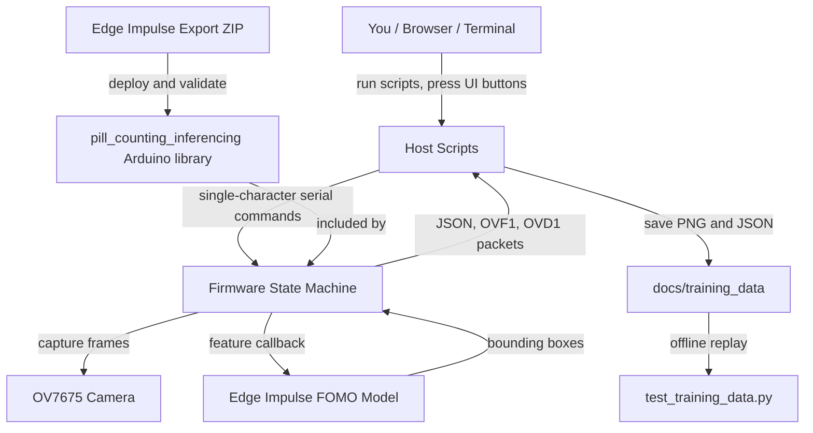

### How To Read This Map

The laptop starts most workflows, but the board owns the real device behavior. The laptop sends commands like `J`, `S`, or `D`. The firmware switches modes, captures frames, runs inference when needed, and sends results back.

| System | Purpose | Key Files |
| --- | --- | --- |
| Firmware | Camera capture, exposure, inference, counting, serial protocol | `nano_33/nano_33.ino` |
| Host shell scripts | Simple entrypoints for upload, monitor, viewers, collectors | `scripts/*.sh` |
| Python viewers | Decode serial packets and show camera/detection output | `scripts/live_camera_view.py`, `scripts/live_detect_view.py`, `scripts/detect_web.py` |
| Browser templates | UI for viewer and collectors | `scripts/templates/*.html` |
| Training data | Saved images and optional detection metadata | `docs/training_data/` |
| Model deployment | Install and validate Edge Impulse export | `scripts/ei_deploy.sh` |
| Offline validation | Run saved images through the model outside the board | `scripts/test_training_data.py` |
| Learning artifacts | Course and code tour for orientation | `nano33-course/`, `tours/new-joiner-nano-33-overview.tour` |

> **Exploration task:** Open `README.md`, then open `nano_33/nano_33.ino`. Find the command table in the README and the matching `switch` statement in `handleSerialCommands()`. For each command, ask: "Which mode does this turn on or off?"

---

## 4. The Workflows You Actually Use

This section explains the common workflows in plain language first, then points to the code.

### Workflow A: Compile Or Upload Firmware

**What you run:**

```bash
SKIP_UPLOAD=1 ./scripts/upload.sh
./scripts/upload.sh
```

**What happens:**

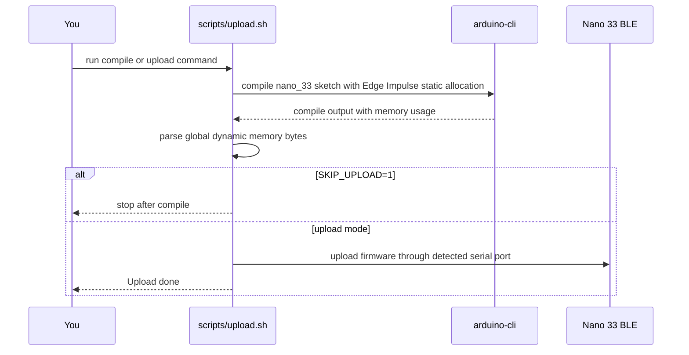

**Key file:** `scripts/upload.sh`

**Important idea:** Compile-only mode is the first safety check. It catches syntax errors and RAM problems before flashing the board.

**Worked snippet:**

```bash
RAM_WARN_BYTES="${RAM_WARN_BYTES:-210000}"
RAM_MAX_BYTES="${RAM_MAX_BYTES:-220000}"
EI_EXTRA_FLAGS="${EI_EXTRA_FLAGS:--DEI_CLASSIFIER_ALLOCATION_STATIC}"
```

These variables are guardrails. The script compiles with static Edge Impulse allocation and refuses firmware that uses too much global dynamic memory.

> **Predict & verify:** Before running `SKIP_UPLOAD=1 ./scripts/upload.sh`, predict whether it needs the board plugged in. Then run it. If it only compiles, it should not need an upload port.

### Workflow B: Production Count - Send `J`, Get JSON

This is the most important workflow for real counting.

**What you do:** Send command `J` over serial.

**What the board does:** Capture one frame, run one inference, count valid `blister` boxes, print one JSON line.

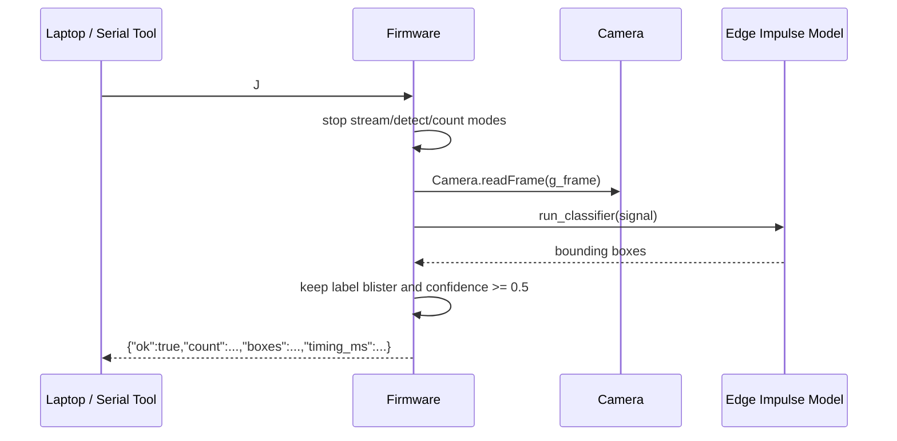

**Key file:** `nano_33/nano_33.ino`

**Functions to know:**

- `handleSerialCommands()` receives `J`
- `doJsonCount()` performs the full count
- `runInference()` bridges firmware to Edge Impulse
- `isTargetDetection()` filters detections
- `mapDetectionBoxToFrame()` converts model box coordinates back to camera-frame coordinates

**Worked snippet:**

```cpp
case 'J':
case 'j':
  g_streaming = false;
  g_detecting = false;
  g_counting = false;
  doJsonCount();
  break;
```

This is the command router. It makes `J` a single-shot action. It turns off the continuous modes first, then calls `doJsonCount()`.

```cpp
bool isTargetDetection(const ei_impulse_result_bounding_box_t &bb) {
  return bb.value >= kConfidenceThreshold && strcmp(bb.label, "blister") == 0;
}
```

This is the counting rule. A model box only counts if it has the right label and enough confidence.

> **Why this way?** Why return JSON for production instead of image bytes? Because JSON is small, easy to parse, and stable for automation. Image streams are useful for debugging, but they are slower and harder to use as a production result.

> **Explore:** In `nano_33/nano_33.ino`, find `doJsonCount()`. Before reading it, predict the order of operations: capture, inference, filter, print. Then verify the order in code.

### Workflow C: Browser Detection Viewer - `D` Stream

**What you run:**

```bash
./scripts/detect_web.sh
```

Then open:

```text
http://localhost:5050
```

**What happens:**

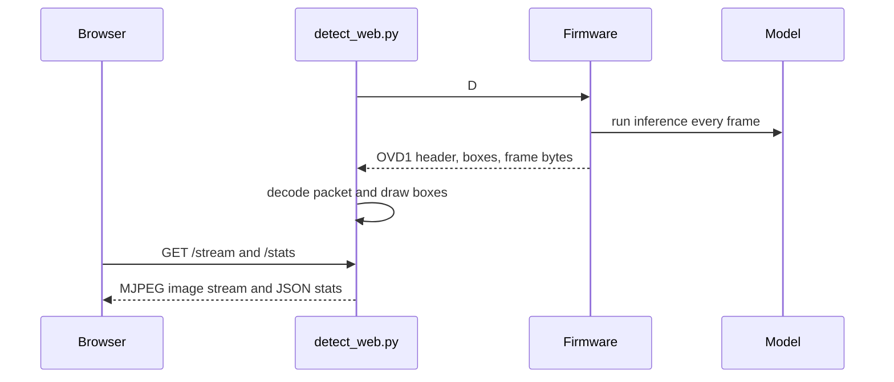

**Key files:**

- `scripts/detect_web.sh`
- `scripts/detect_web.py`
- `scripts/templates/detect.html`
- `nano_33/nano_33.ino`

**The packet contract:**

`D` mode sends binary packets with magic bytes `OVD1`.

```text
OVD1
width, height, bytes_per_pixel, format, frame_number, frame_size, detection_count
detection boxes
raw grayscale frame bytes
```

The Python code has to match the firmware exactly:

```python
MAGIC = b"OVD1"
DET_STRUCT = struct.Struct("<HHHHH")
HEADER_STRUCT = struct.Struct("<HHBBIIH")
```

**Pattern:** This is a simple [Producer-Consumer](https://en.wikipedia.org/wiki/Producer%E2%80%93consumer_problem) flow. The board produces packets. The Python reader consumes them, converts them to JPEG and stats, then the browser consumes those.

> **Why this way?** Why use a binary packet instead of printing text for every frame? Binary packets are faster and easier to align with image bytes. Text is easier for humans, but slower and more fragile for live image streams.

> **Explore:** In `scripts/detect_web.py`, find `read_packet()`. Then find `writeDetectionHeader()` and `writeDetectionBox()` in `nano_33/nano_33.ino`. Match the Python struct fields to the firmware write order.

### Workflow D: Raw Image Collection - `S` Stream

**What you run:**

```bash
./scripts/collect.sh
```

Then open the collector page shown by the script.

**What happens:** The board streams raw frames. The browser collector saves the latest grayscale frame as `docs/training_data/blister_0001.png`, `blister_0002.png`, and so on.

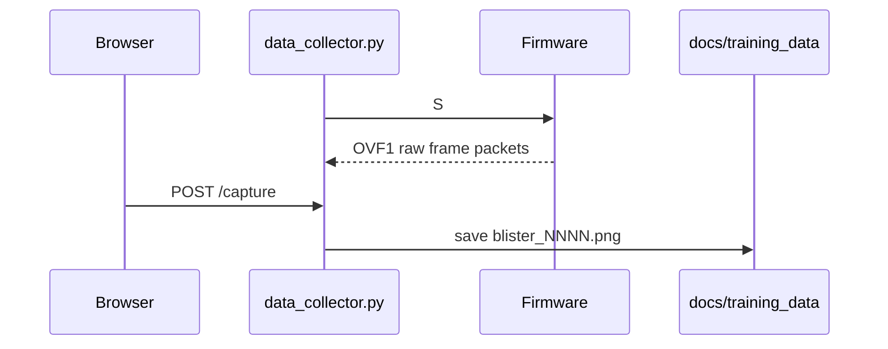

**Key files:**

- `scripts/data_collector.py`
- `scripts/templates/index.html`
- `docs/training_data/`

**Important difference from detection collection:** Raw collection saves images without relying on the model's current detections.

> **Explore:** Find `MAGIC = b"OVF1"` in `scripts/data_collector.py`. Then find `kFrameMagic` and `writeFrameHeader()` in firmware. This is the raw-frame version of the packet protocol.

### Workflow E: Detection-Assisted Collection

**What you run:**

```bash
./scripts/collect_detect.sh
```

**What happens:** The board runs detection stream mode. The collector saves both the grayscale PNG and a matching JSON file containing board-side detections.

**Key files:**

- `scripts/detect_data_collector.py`
- `scripts/templates/collect_detect.html`
- `docs/training_data/*.png`
- `docs/training_data/*.json`

**What gets saved:**

```json
{
  "filename": "blister_0172.png",
  "pill_count": 4,
  "detections": [
    {"x": 10, "y": 20, "w": 12, "h": 12, "confidence": 0.82}
  ],
  "width": 160,
  "height": 120
}
```

This is useful when you want to keep evidence of what the board thought it saw at capture time.

> **Predict & verify:** Before reading `detect_data_collector.py`, predict why it needs both `state_lock` and `capture_file_lock`. Then inspect the code. One protects shared live state; the other protects file numbering and writes.

### Workflow F: Deploy A New Edge Impulse Model

**What you run:**

```bash
./scripts/ei_deploy.sh ~/Downloads/pill-counting-cpp-mcu.zip
```

**What happens:**

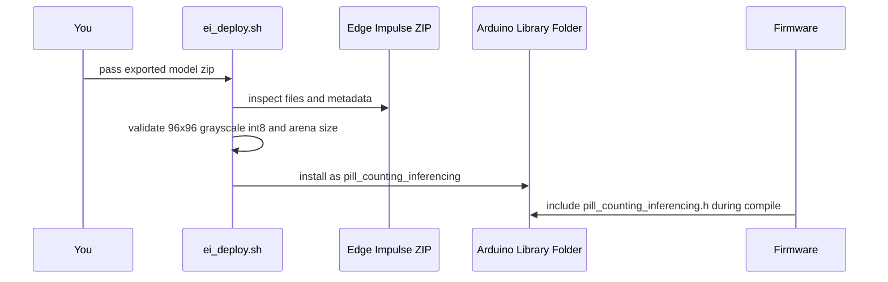

**Key file:** `scripts/ei_deploy.sh`

**Important contract:**

- library name: `pill_counting_inferencing`
- input width: `96`
- input height: `96`
- grayscale samples per frame: `1`
- input type: int8
- arena budget: target under 120 KB, hard limit 140 KB

**Pattern:** This is a [Build Pipeline](https://martinfowler.com/articles/continuousIntegration.html) style gate. A model export must pass checks before it becomes part of the local Arduino library environment.

> **Why this way?** Why validate the ZIP before compiling firmware? Because a model can be valid in Edge Impulse Studio but still impossible to run on the Nano 33 BLE.

> **Explore:** In `scripts/ei_deploy.sh`, find `validate_model()`. List the exact assumptions it enforces. Then compare those assumptions with the constants near the top of `nano_33/nano_33.ino`.

### Workflow G: Test Saved Training Data Offline

**What you run:**

```bash
.venv/bin/python scripts/test_training_data.py --limit 10 --rebuild
```

**What happens:** The script builds a local C++ classifier runner, preprocesses saved `docs/training_data/*.png` images like the firmware does, runs the Edge Impulse model, and writes CSV results.

**Key file:** `scripts/test_training_data.py`

**Why it exists:** It gives you evidence without needing to manually watch the camera. It is not a perfect replacement for hardware testing, but it helps answer "does this model detect anything on our saved images?"

**Pattern:** This is a [Golden Master / Characterization Test](https://michaelfeathers.silvrback.com/characterization-testing) style tool. It captures current behavior over real samples so changes can be compared.

> **Explore:** Compare `preprocess()` in `scripts/test_training_data.py` with `initializeInferenceMap()` and `ei_get_frame_data()` in firmware. Their job is the same: convert a 160x120 grayscale image into the 96x96 model view.

---

## 5. Deep Dive: Firmware

### Purpose

The firmware is the embedded application. It runs on the Nano 33 BLE and owns the hardware. If the physical device behaves differently, this is usually where to look first.

### Pattern

**Pattern:** [Finite State Machine](https://en.wikipedia.org/wiki/Finite-state_machine) - the board is always in one of a few modes: paused, raw streaming, detection streaming, or continuous counting.

### Key Abstractions

| Abstraction | Role | Location |
| --- | --- | --- |
| `g_frame` | One global 160x120 grayscale image buffer | `nano_33/nano_33.ino` |
| `g_streaming` | Whether raw frame stream mode is active | `nano_33/nano_33.ino` |
| `g_detecting` | Whether detection packet stream mode is active | `nano_33/nano_33.ino` |
| `g_counting` | Whether repeated text count mode is active | `nano_33/nano_33.ino` |
| `ei_get_frame_data()` | Edge Impulse callback that supplies model pixels | `nano_33/nano_33.ino` |
| `handleSerialCommands()` | Command router from serial characters to board behavior | `nano_33/nano_33.ino` |

### Setup Flow

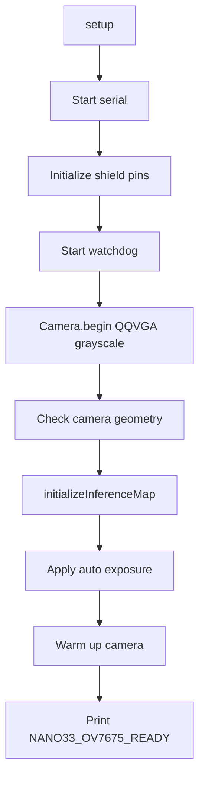

### Loop Flow

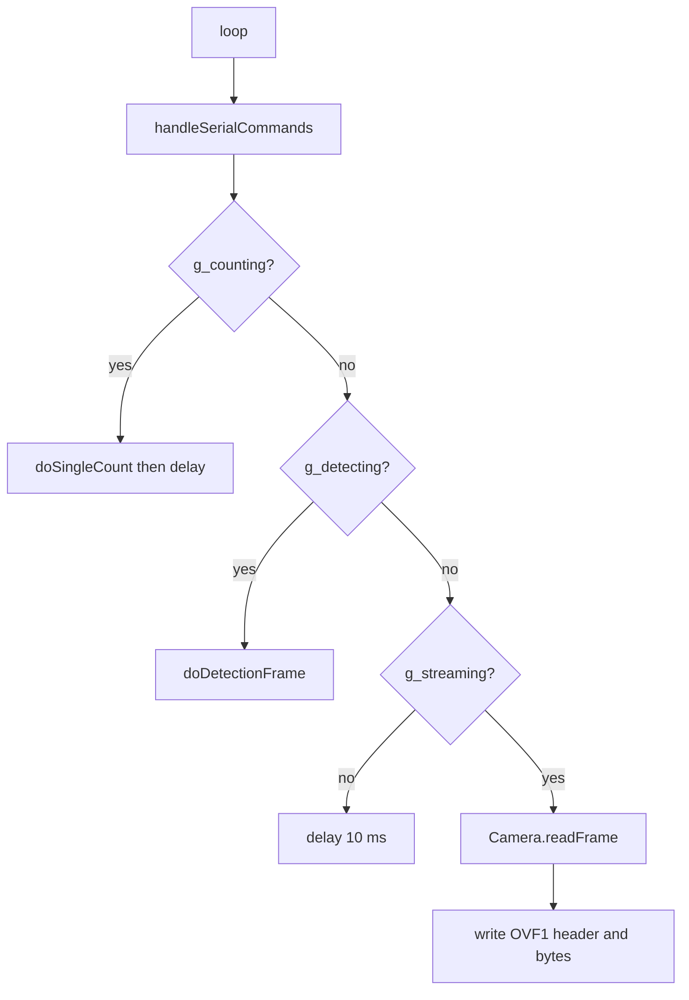

### Design Tradeoffs

The firmware uses one file instead of many modules. That makes the Arduino sketch easy to compile and inspect, but it means you need a mental map of where each section lives:

- constants and memory assumptions near the top
- SCCB camera register helpers after constants
- exposure functions before inference
- inference preprocessing and filtering in the middle
- command actions near the bottom
- `setup()` and `loop()` at the end

> **Why this way?** Why not use a big class hierarchy? For this small embedded project, simple globals and functions are easier to audit for RAM, startup order, and hardware side effects.

> **Explore:** Add a comment in your notes, not the code, explaining each global flag: `g_streaming`, `g_detecting`, `g_counting`. Then predict what happens if two are true at once. Finally, read `handleSerialCommands()` and see how commands prevent that.

---

## 6. Deep Dive: Serial Protocol

### Purpose

Serial is the only bridge between the laptop and the board. Every viewer, collector, and monitor depends on this contract.

### Commands

| Command | Meaning | Main Firmware Path |
| --- | --- | --- |
| `S` | Start raw frame streaming | `writeFrameHeader()` plus frame bytes |
| `P` | Pause raw/detection streaming | mode flags off |
| `J` | Single production JSON count | `doJsonCount()` |
| `C` | Single text count | `doSingleCount(true)` |
| `K` | Continuous text counts | `g_counting = true` |
| `D` | Detection stream with boxes and frame bytes | `doDetectionFrame()` |
| `X` | Stop count/detect mode | mode flags off |
| `F` | Face exposure preset | `applyFaceExposure()` |
| `A` | Auto exposure | `applyAutoExposure()` |
| `c` | Calibrated exposure | `applyCalibratedExposure()` |
| `T` | Timing profile | `doTimedCount()` |
| `M` | Memory/model diagnostics | `printMemoryStatus()` |
| `?` | Print ready/help text | `printReady()` |

### Packet Types

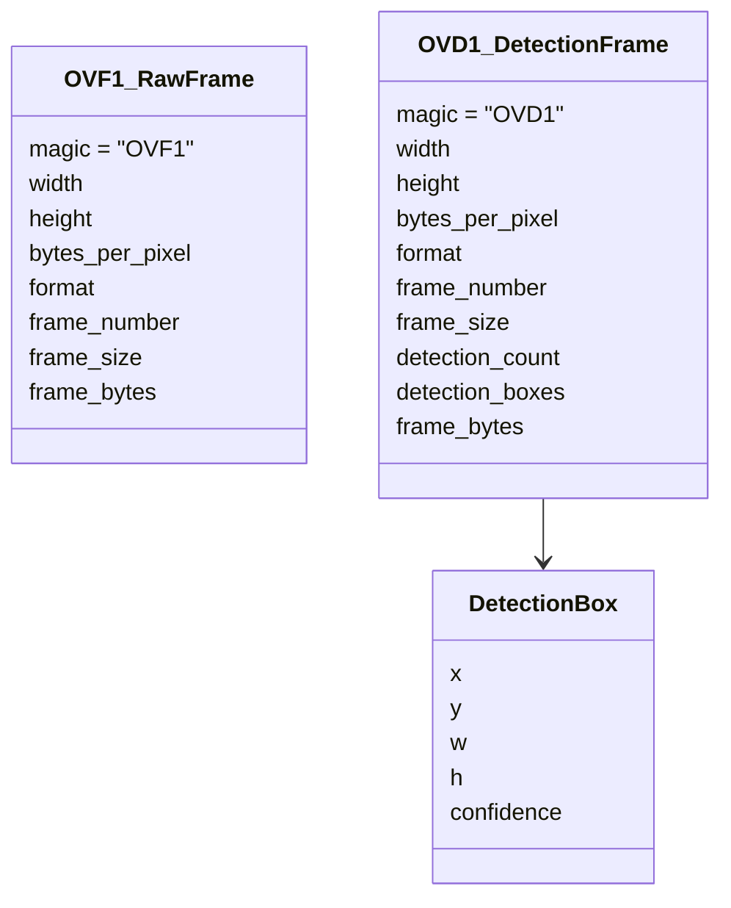

### Pattern

**Pattern:** [Protocol Boundary](https://martinfowler.com/bliki/BoundedContext.html) - firmware and Python are separate worlds, so they need an explicit shared language.

When firmware writes:

```cpp
writeU16(kFrameWidth);
writeU16(kFrameHeight);
Serial.write(kBytesPerPixel);
Serial.write(kFormatGrayscale);
writeU32(g_frameNumber);
writeU32(kFrameBytes);
```

Python must read the same structure in the same order:

```python
HEADER_STRUCT = struct.Struct("<HHBBII")
```

For detection packets, Python uses:

```python
HEADER_STRUCT = struct.Struct("<HHBBIIH")
DET_STRUCT = struct.Struct("<HHHHH")
```

The extra `H` is `detection_count`.

> **Why this way?** Why do the Python files duplicate protocol details instead of importing them from firmware? Firmware is C++ on a microcontroller and Python runs on the laptop. There is no shared runtime, so the contract is copied. That is simple, but it means protocol changes must update both sides.

> **Explore:** Ask AI: "Show me every file that knows about `OVD1` and explain how changing the detection packet would affect each one." Then compare its answer with `rg "OVD1|HEADER_STRUCT|DET_STRUCT"`.

---

## 7. Deep Dive: Host Tools

### Purpose

The scripts are your control panel. They hide long commands and make common tasks repeatable.

### Shell Entrypoints

| Script | What It Does |
| --- | --- |
| `scripts/port.sh` | Finds the Nano 33 serial port |
| `scripts/upload.sh` | Compiles, checks RAM, optionally uploads |
| `scripts/monitor.sh` | Opens serial monitor at 921600 baud |
| `scripts/live_view.sh` | Starts OpenCV raw camera viewer |
| `scripts/live_detect.sh` | Starts OpenCV detection viewer |
| `scripts/detect_web.sh` | Starts browser detection app |
| `scripts/collect.sh` | Starts raw image collector |
| `scripts/collect_detect.sh` | Starts detection-assisted collector |
| `scripts/ei_deploy.sh` | Installs and validates Edge Impulse export |

### Python Tool Roles

| Python File | Role |
| --- | --- |
| `live_camera_view.py` | OpenCV viewer for raw frame stream |
| `live_detect_view.py` | OpenCV viewer for detection stream |
| `detect_web.py` | Flask app for browser detection view |
| `data_collector.py` | Flask app for saving raw PNG captures |
| `detect_data_collector.py` | Flask app for saving PNG plus detection JSON |
| `calibrate_wb.py` | Computes host-side white balance gains from a reference image |
| `test_training_data.py` | Offline model check over saved training images |

### Pattern

**Pattern:** [Adapter](https://refactoring.guru/design-patterns/adapter) - each script adapts the same board protocol to a different user experience: terminal, OpenCV window, browser UI, file collector, or CSV checker.

> **Why this way?** Why have multiple scripts instead of one giant app? Each workflow is easier to run and debug when it has a small entrypoint. Hardware projects benefit from simple tools because serial ports, browsers, cameras, and uploads can fail independently.

> **Explore:** Pick one script, such as `scripts/detect_web.sh`. Read it top to bottom. Notice that it mostly finds `ROOT`, finds `PORT`, and executes the matching Python file. Shell scripts are wrappers, not the main logic.

---

## 8. Deep Dive: Model And Data Pipeline

### Purpose

The model pipeline turns captured images into an Edge Impulse model that can run on the Nano 33 BLE.

### Data Lifecycle

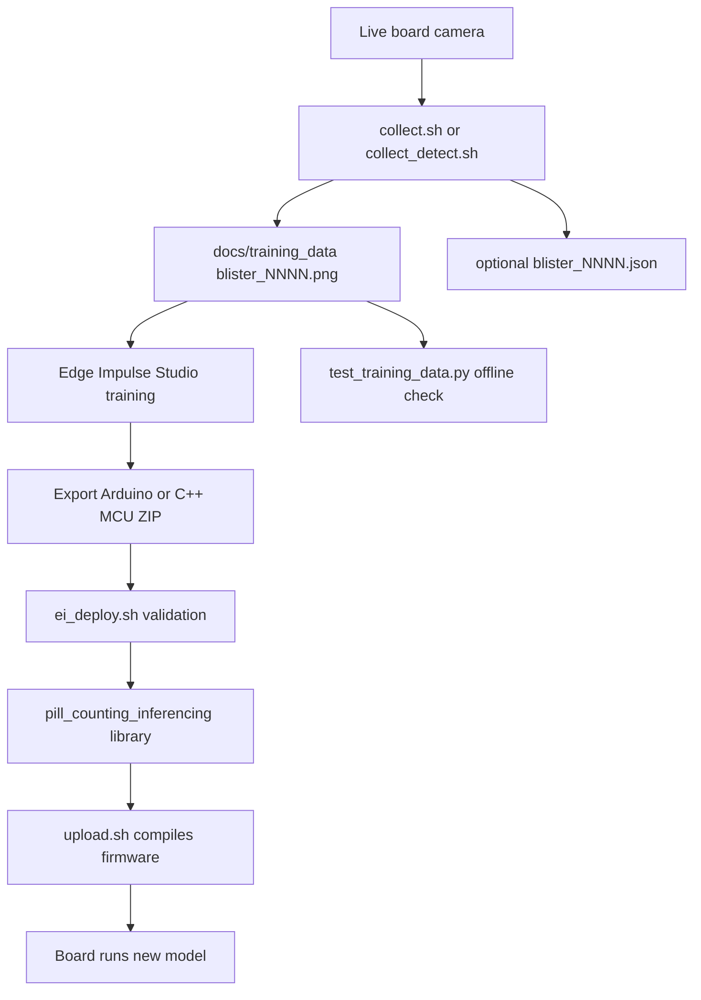

### Model Contract

The firmware expects the model to be:

- Edge Impulse object detection, FOMO-style
- input width `96`
- input height `96`
- grayscale input
- int8 quantized
- small enough for Nano 33 BLE SRAM
- installed as `pill_counting_inferencing`

### Pattern

**Pattern:** [Contract Test](https://martinfowler.com/bliki/ContractTest.html) - `ei_deploy.sh` enforces the agreement between the model export and firmware before the model is allowed into the Arduino library folder.

> **Why this way?** Why not just install any model and see what happens? Because model mismatch can fail late, be hard to debug, or crash the board. A clear deploy gate gives you fast feedback.

> **Explore:** Read `docs/research/findings.md`. Find the notes about `J`, `T`, confidence filtering, and why production should use single-shot JSON instead of detection streaming.

---

## 9. Patterns And Conventions

Recognizing patterns helps you ask better AI prompts.

### Finite State Machine

**What it is:** A system with explicit modes and transitions.

**Where it appears:** `g_streaming`, `g_detecting`, `g_counting`, and `handleSerialCommands()`.

**Why it is used here:** The board cannot safely do every mode at once. Commands switch between modes.

**Learn more:** [Finite-state machine](https://en.wikipedia.org/wiki/Finite-state_machine)

### Binary Framing Protocol

**What it is:** A structured way to send bytes so the reader knows where packets begin and how long they are.

**Where it appears:** `OVF1`, `OVD1`, `writeFrameHeader()`, `writeDetectionHeader()`, Python `HEADER_STRUCT`.

**Why it is used here:** Image bytes are not human text. The receiver needs magic bytes and sizes to stay aligned.

**Learn more:** [Data serialization](https://en.wikipedia.org/wiki/Serialization)

### Adapter Scripts

**What it is:** Small programs that translate a lower-level interface into a useful tool.

**Where it appears:** shell scripts and Python viewers.

**Why it is used here:** The board only knows serial commands. The scripts adapt that into upload commands, OpenCV windows, browser pages, image captures, and CSV checks.

**Learn more:** [Adapter pattern](https://refactoring.guru/design-patterns/adapter)

### Guardrail Checks

**What it is:** Checks that fail early when assumptions are violated.

**Where it appears:** firmware `static_assert`, `scripts/upload.sh` RAM limits, `scripts/ei_deploy.sh` model validation.

**Why it is used here:** Embedded failures are painful to debug after upload. Fast compile/deploy failures are better.

**Learn more:** [Fail fast](https://en.wikipedia.org/wiki/Fail-fast)

### Naming Conventions

| Convention | Example | Meaning |
| --- | --- | --- |
| `kName` | `kFrameWidth` | constant value |
| `g_name` | `g_frame` | global state |
| lower camel case | `doJsonCount()` | function |
| `*.sh` | `upload.sh` | shell entrypoint |
| `*.py` | `detect_web.py` | Python tool |
| `blister_NNNN.png` | `blister_0172.png` | captured training image |

---

## 10. Boundaries And External Systems

| External System | Purpose | Integration Point | Risk |
| --- | --- | --- | --- |
| Arduino CLI | Compile, upload, monitor | `scripts/upload.sh`, `scripts/monitor.sh`, `scripts/port.sh` | Missing board core, wrong port, upload timeout |
| OV7675 camera | Provides image frames | `Camera.begin()`, `Camera.readFrame()` | Geometry mismatch, exposure instability |
| Edge Impulse library | Runs FOMO model | `pill_counting_inferencing.h`, `run_classifier()` | Wrong model shape, too much RAM, wrong label threshold |
| USB serial | Host-board communication | firmware `Serial`, Python `pyserial` | Port busy, packet desync, baud mismatch |
| Flask/browser | Browser UI and capture tools | `detect_web.py`, `data_collector.py`, templates | Browser shows stale state if serial reader fails |
| OpenCV | Decode, resize, draw, save frames | Python viewers and collectors | Missing dependency, image write failure |
| Local Arduino libraries folder | Stores deployed model | `~/Documents/Arduino/libraries/pill_counting_inferencing` | Local machine state not tracked by git |

**Error handling philosophy:** Most scripts fail fast when required hardware or files are missing. Live viewers often skip malformed packets and continue. Firmware uses a fatal blink if the camera cannot initialize.

> **Explore:** Unplug the board and run `./scripts/port.sh`. Read the error message. This teaches you what a missing hardware boundary looks like.

---

## 11. Testing Strategy

There is no big unit-test suite. The project uses practical checks.

### Firmware Compile Check

```bash
SKIP_UPLOAD=1 ./scripts/upload.sh
```

Use this after firmware changes. It checks C++ compile success and RAM usage.

### Hardware Upload

```bash
./scripts/upload.sh
```

Use this when you need to test real board behavior.

### Serial Smoke Tests

```bash
./scripts/monitor.sh
```

Then try:

```text
?
M
T
J
```

Expected style of output:

- `?` prints readiness and command help
- `M` prints memory/model diagnostics
- `T` prints profile timing
- `J` prints one JSON count result

### Browser Viewer Smoke Test

```bash
./scripts/detect_web.sh
```

Open `http://localhost:5050` and confirm:

- serial status goes online
- image stream appears
- count, FPS, frame ID update
- exposure buttons send commands without killing the stream

### Offline Training Data Check

```bash
.venv/bin/python scripts/test_training_data.py --limit 10 --rebuild
```

Use this when the Edge Impulse library is installed and you want model behavior over saved images.

> **Explore:** Break learning into two questions: "Does it compile?" and "Does the board behave?" Run compile-only before hardware tests.

---

## 12. How To Ask AI For Good Changes

When you are vibecoding, your prompt should name the workflow, the files, the constraints, and the verification command.

### Good Prompt For Firmware

```text
I want to change the production count behavior for command J.
Please inspect nano_33/nano_33.ino, especially handleSerialCommands(),
doJsonCount(), isTargetDetection(), and printJsonTiming().
Keep the 160x120 grayscale frame buffer and avoid adding another image buffer.
After editing, run SKIP_UPLOAD=1 ./scripts/upload.sh and report RAM usage.
```

### Good Prompt For Browser Viewer

```text
I want to change the browser detection UI only.
Please inspect scripts/detect_web.py and scripts/templates/detect.html.
Do not change firmware or the serial packet protocol unless necessary.
After editing, run a syntax check for the Python file and tell me how to smoke test
with ./scripts/detect_web.sh.
```

### Good Prompt For Protocol Changes

```text
I want to add one field to detection stream packets.
Please inspect both firmware packet writers in nano_33/nano_33.ino and all Python
readers that use OVD1, HEADER_STRUCT, or DET_STRUCT.
Update both sides consistently and explain the packet layout before editing.
```

### Good Prompt For Model Changes

```text
I have a new Edge Impulse export. Before changing firmware, inspect scripts/ei_deploy.sh,
README.md, and nano_33/nano_33.ino model assumptions.
Tell me whether the new model must stay 96x96 grayscale int8 and what checks will fail
if it does not.
```

### Bad Prompt Shape

```text
Make it better.
```

This is too broad. AI may edit the wrong layer.

### Better Prompt Shape

```text
Improve the J single-shot count result by adding a field named "valid_boxes"
that equals the number of boxes passing isTargetDetection().
Only edit nano_33/nano_33.ino. Keep JSON valid. Run compile-only verification.
```

---

## 13. Your Learning Path

### Day 1: Know The Map

- [ ] Read Sections 1-3.
- [ ] Open `README.md`.
- [ ] Open `nano_33/nano_33.ino`.
- [ ] Find `setup()`, `loop()`, and `handleSerialCommands()`.
- [ ] Explain in your own words why `J` is the production count command.

### Day 2: Trace One Flow

- [ ] Trace command `J` from `handleSerialCommands()` to `doJsonCount()`.
- [ ] Find where `Camera.readFrame(g_frame)` happens.
- [ ] Find where `run_classifier()` happens.
- [ ] Find where JSON is printed.
- [ ] Write a one-paragraph explanation of the flow.

### Day 3: Trace The Browser Viewer

- [ ] Run or read `scripts/detect_web.sh`.
- [ ] Open `scripts/detect_web.py`.
- [ ] Find where it sends `b"D"`.
- [ ] Find `read_packet()`.
- [ ] Open `scripts/templates/detect.html`.
- [ ] Find `/stream`, `/stats`, and `/control`.

### Day 4: Understand Data Capture

- [ ] Compare `scripts/data_collector.py` and `scripts/detect_data_collector.py`.
- [ ] Identify which one uses `OVF1` and which one uses `OVD1`.
- [ ] Inspect `docs/training_data/`.
- [ ] Open one `.json` metadata file if present.

### Day 5: Understand The Model Contract

- [ ] Read `scripts/ei_deploy.sh`.
- [ ] Find `EXPECTED_INPUT_WIDTH`, `EXPECTED_INPUT_HEIGHT`, and `ARENA_MAX_BYTES`.
- [ ] Read the constants near the top of `nano_33/nano_33.ino`.
- [ ] Explain why model size, frame size, and RAM are linked.

### Day 6: Make A Tiny Safe Change

Pick one:

- [ ] Change a browser label in `scripts/templates/detect.html`.
- [ ] Add one extra text field to the `J` JSON output.
- [ ] Add a clearer error message in a Python script.

Then verify with the smallest relevant check.

### Day 7: Teach It Back

Without looking, draw this from memory:

```text
You -> script -> serial command -> firmware mode -> camera/model -> serial result -> script/browser/file
```

Then compare your drawing to the system map in Section 3.

---

## 14. Quick Reference

### Files To Open First

| Question | Open This |
| --- | --- |
| What does the project do? | `README.md` |
| How does the board work? | `nano_33/nano_33.ino` |
| How do I compile/upload? | `scripts/upload.sh` |
| How does browser detection work? | `scripts/detect_web.py`, `scripts/templates/detect.html` |
| How are images collected? | `scripts/data_collector.py`, `scripts/detect_data_collector.py` |
| How is a model installed? | `scripts/ei_deploy.sh` |
| How are saved images tested? | `scripts/test_training_data.py` |
| Why all the RAM constraints? | `docs/model_and_ram.md`, `docs/research/findings.md` |

### Commands To Remember

```bash
./scripts/port.sh
SKIP_UPLOAD=1 ./scripts/upload.sh
./scripts/upload.sh
./scripts/monitor.sh
./scripts/detect_web.sh
./scripts/collect.sh
./scripts/collect_detect.sh
.venv/bin/python scripts/test_training_data.py --limit 10 --rebuild
```

### Mental Debug Checklist

1. Is the board plugged in and visible? Run `./scripts/port.sh`.
2. Does firmware compile? Run `SKIP_UPLOAD=1 ./scripts/upload.sh`.
3. Is the model installed with the expected name? Check `pill_counting_inferencing`.
4. Is another tool holding the serial port? Close monitors/viewers.
5. Does the board print ready? Use `./scripts/monitor.sh` and command `?`.
6. Does production count work? Send `J`.
7. Does live detection work? Run `./scripts/detect_web.sh`.
8. Does offline data still behave? Run `scripts/test_training_data.py`.

---

## 15. The Whole Project In One Flow

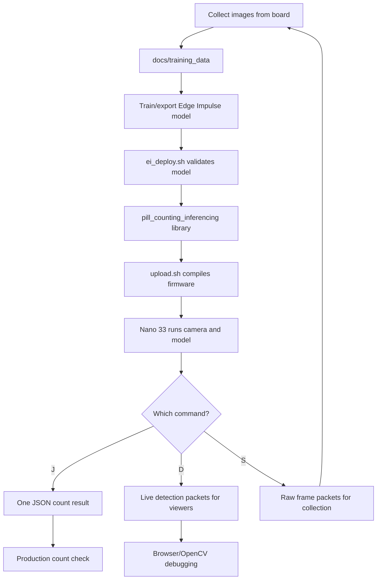

If you remember only one thing, remember this:

**The firmware owns behavior. The scripts own workflows. The model export owns detection ability. The serial protocol connects them.**
